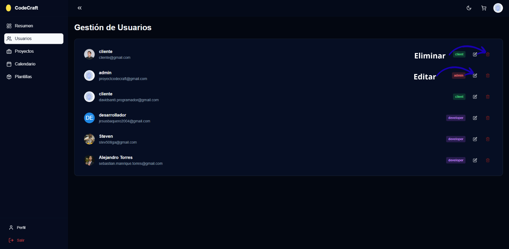

# Módulo API

Contiene los endpoints del backend que permiten la comunicación con el cliente.

## Funcionalidades
- CRUD de usuarios

<em>Figura 1. Panel principal de Code Craft mostrando las solicitudes del cliente.</em>

