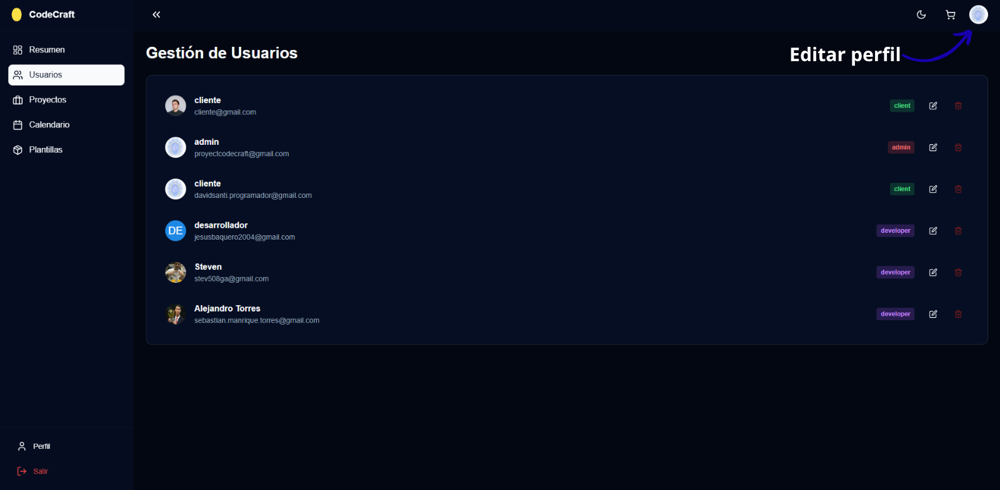
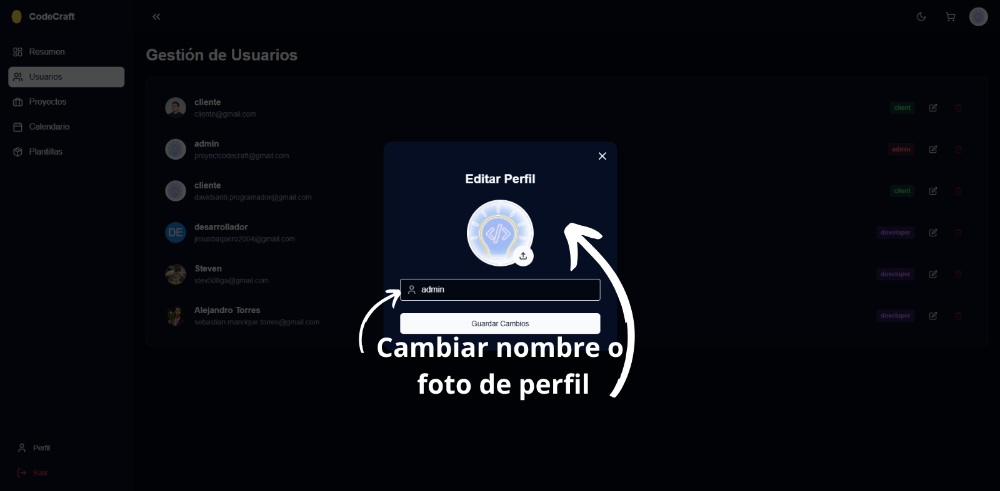
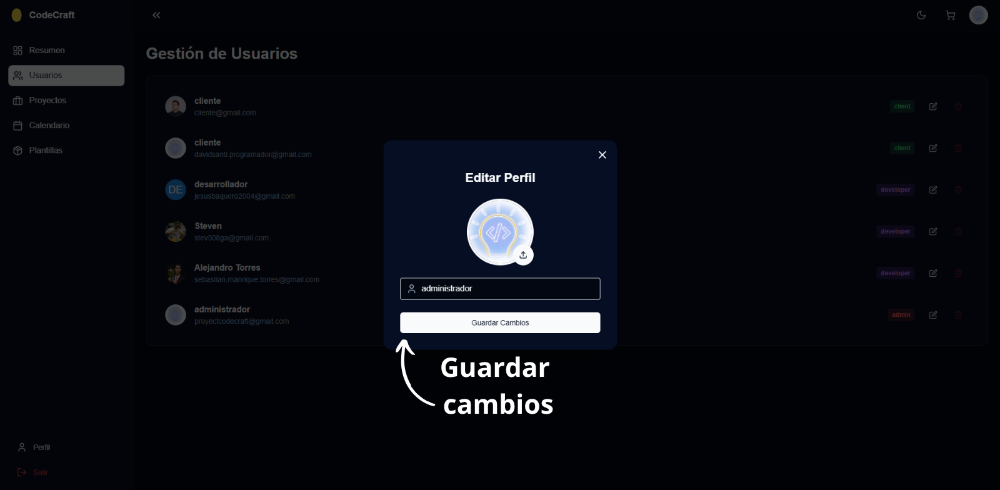

# Módulo Dashboard

Pantalla principal que presenta las estadísticas y herramientas del sistema.

## Funcionalidades
- Configuración de perfil

### Vista general del panel

### Estadísticas del sistema

### Configuración de perfil

