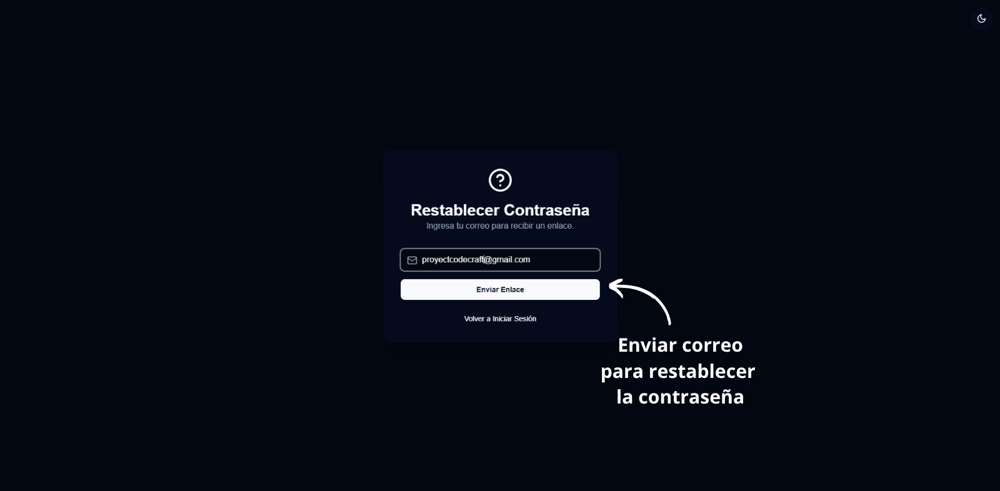
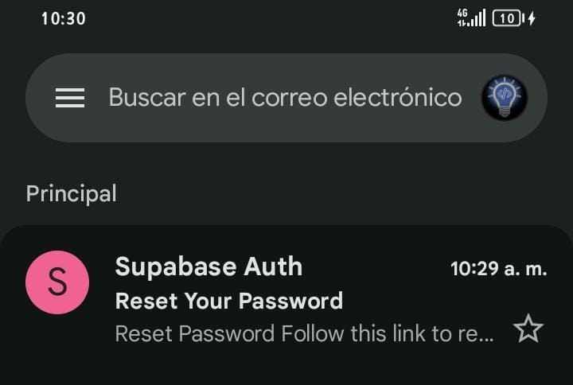
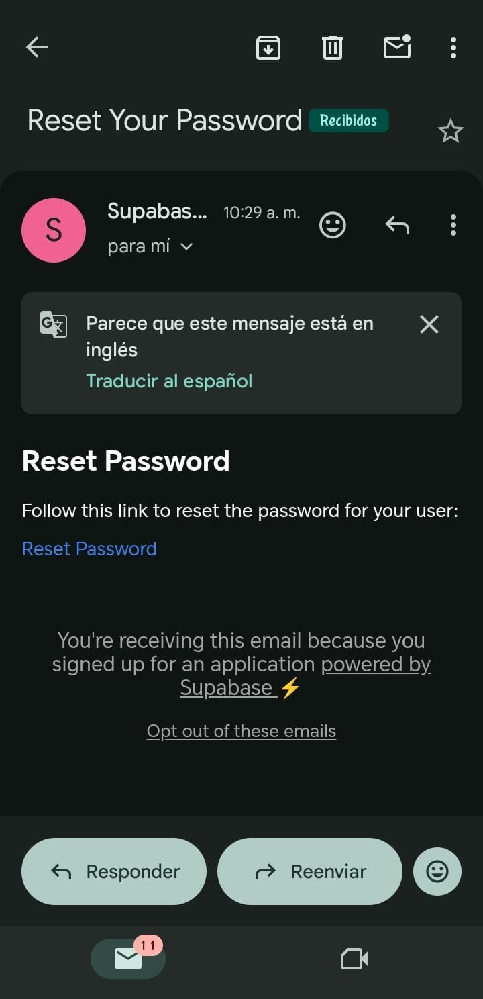

# Módulo de Inicio de Sesión

Permite a los usuarios autenticarse de forma segura en la plataforma.

## Funcionalidades
- Validación de credenciales
- Recuperación de contraseña

### Pantalla de inicio de sesión

<em>Figura 1. Formulario principal de inicio de sesión en Code Craft.</em>

### Validación de credenciales

<em>Figura 2. Proceso de validación de usuario y contraseña.</em>

### Recuperación de contraseña

<em>Figura 3. Interfaz para restablecer la contraseña del usuario.</em>

