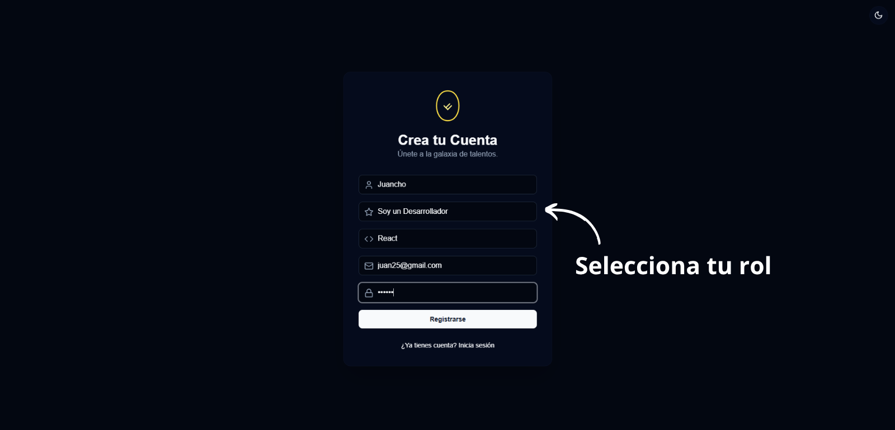
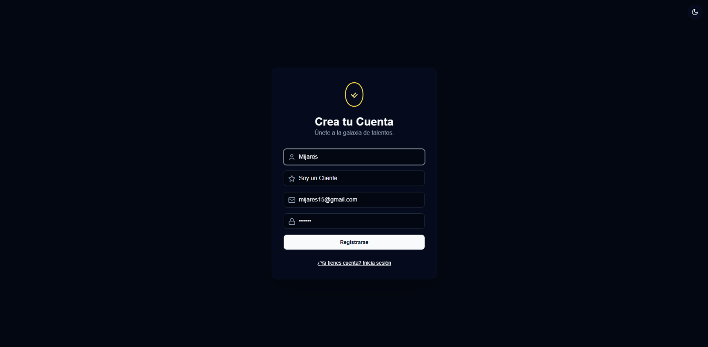

# Módulo de Gestión de Usuarios

Administración de cuentas, roles y permisos dentro del sistema.

## Funcionalidades
- Asignación de roles

### Panel de gestión

<em>Figura 1. Panel principal de gestión de usuarios en Code Craft.</em>

### Asignación de roles

<em>Figura 2. Interfaz para asignar roles y permisos a los usuarios.</em>

